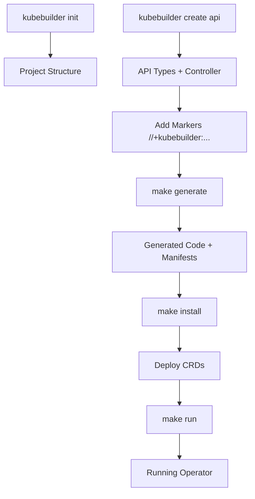

# Day 8: Introduction to Kubebuilder - Complete Study Guide

*Time: 45 minutes | Focus: Understanding Kubebuilder framework and ODH's usage*

## What is Kubebuilder? (10 minutes)

### The Problem Kubebuilder Solves

Before Kubebuilder, creating Kubernetes operators required:
- Deep understanding of client-go internals
- Lots of boilerplate code for controllers
- Manual setup of managers, informers, and reconcilers
- Custom project structure and build processes

### Kubebuilder's Solution

Kubebuilder is a framework that:
- **Scaffolds** complete operator projects with best practices
- **Generates** boilerplate code from simple markers
- **Standardizes** project structure across operators
- **Integrates** seamlessly with controller-runtime
- **Automates** manifest generation for CRDs, RBAC, etc.

Think of it as "Rails for Kubernetes operators" - convention over configuration.

### Key Kubebuilder Concepts

```
Kubebuilder Framework
├── Project Scaffolding (kubebuilder init)
├── API Scaffolding (kubebuilder create api)
├── Code Generation (controller-gen)
├── Manifest Generation (kustomize)
└── Testing & Deployment Tools
```

## Kubebuilder Architecture (10 minutes)

### Core Components

1. **CLI Tool (`kubebuilder`)**
   - Project initialization and scaffolding
   - API and controller creation
   - Webhook generation

2. **Code Generators**
   - `controller-gen`: Generates CRDs, RBAC, webhooks
   - `conversion-gen`: Handles API version conversions
   - Built on top of Kubernetes code generators

3. **Project Structure**
   ```
   my-operator/
   ├── api/v1/              # API types and schemas
   ├── controllers/         # Reconciler logic
   ├── config/              # Kustomize manifests
   │   ├── crd/             # CRD definitions
   │   ├── rbac/            # RBAC permissions
   │   ├── manager/         # Deployment manifests
   │   └── samples/         # Example custom resources
   ├── main.go              # Manager setup and controller registration
   └── Makefile             # Build, test, deploy targets
   ```

4. **Integration with Controller-Runtime**
   - Kubebuilder generates controller-runtime compatible code
   - Uses Manager pattern for controller lifecycle
   - Leverages Builder pattern for controller setup

### How Kubebuilder Works



## ODH Operator and Kubebuilder (15 minutes)

### ODH's Kubebuilder Usage

Let's examine how ODH uses Kubebuilder by looking at the project structure:

```bash
# ODH operator structure (Kubebuilder-generated)
/Users/suksubra/Documents/Work/RHOAI/opendatahub-operator/
├── apis/                    # API definitions
│   ├── datasciencecluster/  # DSC API types
│   └── dscinitialization/   # DSCI API types
├── controllers/             # Reconciler implementations
│   ├── datasciencecluster/  # DSC controller
│   └── dscinitialization/   # DSCI controller
├── config/                  # Kubebuilder-generated manifests
├── main.go                  # Manager setup
└── PROJECT                  # Kubebuilder project metadata
```

### Key ODH Files Generated by Kubebuilder

1. **`PROJECT` file** - Kubebuilder metadata:
```yaml
domain: opendatahub.io
layout:
- go.kubebuilder.io/v3
projectName: opendatahub-operator
repo: github.com/opendatahub-io/opendatahub-operator
version: "3"
plugins:
  manifests.sdk.operatorframework.io/v2: {}
  scorecard.sdk.operatorframework.io/v2: {}
resources:
- api:
    crdVersion: v1
    namespaced: true
  controller: true
  domain: opendatahub.io
  group: datasciencecluster
  kind: DataScienceCluster
  path: github.com/opendatahub-io/opendatahub-operator/apis/datasciencecluster/v1
  version: v1
```

2. **`main.go`** - Manager setup:
```go
func main() {
    // Kubebuilder-generated manager setup
    mgr, err := ctrl.NewManager(ctrl.GetConfigOrDie(), ctrl.Options{
        Scheme:                 scheme,
        MetricsBindAddress:     metricsAddr,
        Port:                   9443,
        HealthProbeBindAddress: probeAddr,
        LeaderElection:         enableLeaderElection,
        LeaderElectionID:       "07ed84c3.opendatahub.io",
    })

    // Register controllers (Kubebuilder pattern)
    if err = (&controllers.DataScienceClusterReconciler{
        Client: mgr.GetClient(),
        Scheme: mgr.GetScheme(),
    }).SetupWithManager(mgr); err != nil {
        setupLog.Error(err, "unable to create controller", "controller", "DataScienceCluster")
        os.Exit(1)
    }
}
```

3. **API Types** - Generated structure:
```go
// apis/datasciencecluster/v1/datasciencecluster_types.go
//+kubebuilder:object:root=true
//+kubebuilder:subresource:status
//+kubebuilder:resource:path=datascienceclusters,scope=Namespaced

// DataScienceCluster is the Schema for the datascienceclusters API
type DataScienceCluster struct {
    metav1.TypeMeta   `json:",inline"`
    metav1.ObjectMeta `json:"metadata,omitempty"`

    Spec   DataScienceClusterSpec   `json:"spec,omitempty"`
    Status DataScienceClusterStatus `json:"status,omitempty"`
}
```

### Kubebuilder Markers in ODH

ODH uses Kubebuilder markers extensively:

```go
// RBAC generation
//+kubebuilder:rbac:groups=datasciencecluster.opendatahub.io,resources=datascienceclusters,verbs=get;list;watch;create;update;patch;delete
//+kubebuilder:rbac:groups=datasciencecluster.opendatahub.io,resources=datascienceclusters/status,verbs=get;update;patch

// CRD generation
//+kubebuilder:validation:Optional
//+kubebuilder:validation:Pattern="^[a-z0-9]([-a-z0-9]*[a-z0-9])?$"

// Webhook generation
//+kubebuilder:webhook:path=/mutate-datasciencecluster-opendatahub-io-v1-datasciencecluster,mutating=true,failurePolicy=fail,sideEffects=None,groups=datasciencecluster.opendatahub.io,resources=datascienceclusters,verbs=create;update,versions=v1,name=mdatasciencecluster.kb.io,admissionReviewVersions=v1
```

## Kubebuilder Workflow (10 minutes)

### Development Workflow with Kubebuilder

1. **Initialize Project**:
```bash
kubebuilder init --domain sample.io --repo github.com/sample-io/sample-operator 
```

2. **Create APIs**:
```bash
kubebuilder create api --group sample --version v1 --kind Sample
```

3. **Implement Reconciler**:
```go
func (r *DataScienceClusterReconciler) Reconcile(ctx context.Context, req ctrl.Request) (ctrl.Result, error) {
    // Your reconciliation logic here
    return ctrl.Result{}, nil
}
```

4. **Add Markers and Generate**:
```bash
make generate  # Generate code from markers
make manifests # Generate CRDs, RBAC, etc.
```

5. **Test and Deploy**:
```bash
make test           # Run tests
make install        # Install CRDs
make run            # Run locally
make docker-build   # Build container
make deploy         # Deploy to cluster
```

### Kubebuilder vs Hand-Coded Operators

| Aspect | Hand-Coded | Kubebuilder |
|--------|------------|-------------|
| **Setup Time** | Hours/Days | Minutes |
| **Boilerplate** | Manual | Generated |
| **Best Practices** | Must know | Built-in |
| **Consistency** | Varies | Standardized |
| **Maintenance** | High | Lower |
| **Learning Curve** | Steep | Gentler |

### Benefits for ODH

1. **Rapid Development**: ODH team can focus on business logic, not boilerplate
2. **Consistency**: Standard project structure across operator ecosystem
3. **Maintainability**: Generated code follows best practices
4. **Integration**: Works seamlessly with OLM and operator ecosystem
5. **Documentation**: Self-documenting through markers

## Key Takeaways

### What You've Learned

1. **Kubebuilder Purpose**: Framework that simplifies Kubernetes operator development
2. **Architecture**: CLI + Generators + Project Structure + Integration
3. **ODH Usage**: How ODH leverages Kubebuilder for structure and generation
4. **Workflow**: From project init to deployment with Kubebuilder
5. **Benefits**: Faster development, better consistency, easier maintenance

### How This Connects to Previous Days

- **Day 6 (Controller-Runtime)**: Kubebuilder generates controller-runtime code
- **Day 5 (Client-go)**: Kubebuilder abstracts client-go complexity
- **Day 2 (CRDs)**: Kubebuilder generates CRDs from Go types
- **Day 3 (Controllers)**: Kubebuilder scaffolds controller structure

### Preparing for Day 9

Tomorrow you'll dive deeper into:
- Kubebuilder markers and their power
- Code generation process
- Advanced CRD features through markers
- How ODH uses specific markers for validation and behavior

The foundation you've built today will make Day 9's marker system much clearer!